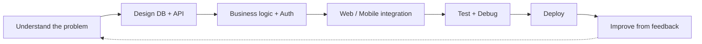

<!-- ============ HEADER ============ -->

 

-1f6feb?style=for-the-badge)

---

## 👋 About Me

I'm a **Computer Science graduate and Full-Stack Developer** based in **Addis Ababa, Ethiopia**, growing into a **backend engineer** who can still ship a complete product.

I like software with a real problem behind it, not just another demo. I build **database → API → business logic → web/mobile client → deployment**, and I care about whether the result is maintainable, secure, and useful to the person using it.

| | |
|---|---|
| 🎯 **Role I'm looking for** | Backend / Full-Stack Developer (.NET or Node.js) |
| 🔭 **Currently improving** | Clean architecture, caching, rate limiting, API versioning, background jobs |
| 🌱 **Currently learning** | Production-ready ASP.NET Core and testing practices |
| 🤝 **Work style** | Git branches, pull requests, code reviews, early communication of blockers |
| 🗣️ **Languages** | Amharic (native) • English (professional) |

---

## 🛠️ Tech Stack

**Backend**

**Frontend**

**Mobile**

**Data & Auth**

**Tools**

---

## 🚀 Featured Projects

<table>
<tr>
<td width="50%" valign="top">

### 🏙️ ShegaReport
**Community reporting platform for municipal problems** (water, electricity, roads, waste)

`NestJS` `PostgreSQL` `Prisma` `JWT` `React Native` `Expo`

- REST API with **JWT auth and RBAC** (Resident, Administrator, Technician)
- Mobile report submission with **GPS location + photos**
- Admin workflow to **assign and track** reports
- **English + Amharic** support
- Took ownership of the project and carried it to deployment

[📂 Repository](https://github.com/NegedeTekleyes/admin-dashboard) • [🌐 Live Demo](https://admin-dashboard-ewwb.vercel.app/)

</td>
<td width="50%" valign="top">

### 🏫 EthioClass
**Multi-tenant school management SaaS** built around Ethiopian school workflows

`.NET 10` `ASP.NET Core` `EF Core` `PostgreSQL` `Angular` `JWT`

- REST API design and validation
- **Multi-tenant** application logic
- Authentication, authorization and RBAC
- Complex relational modeling with EF Core
- Angular frontend integration

[📂 Repository](https://github.com/NegedeTekleyes/EthioClass) <!-- TODO: link the exact repo -->

</td>
</tr>
<tr>
<td width="50%" valign="top">

### 📦 IMS-SMS
**Inventory & Sales Management System** for real business operations

`React Native` `Expo` `Next.js` `Convex` `Clerk` `Zustand`

- Product, inventory, sales and parts management
- Swap-return workflows and VAT-related functionality
- Role-based access + admin dashboard
- Invitation-based user management
- Delivered under a **tight deadline**

[📂 Repository](https://github.com/NegedeTekleyes/IMS-SMS) <!-- TODO: link the exact repo -->

</td>
<td width="50%" valign="top">

### 🧠 IFA
**AI Adaptive Learning Companion** (team project)

`.NET` `Clean Architecture` `SvelteKit` `REST` `AI`

- Built **.NET backend** services and API endpoints
- Course, lesson and quiz **generation workflows**
- Async generation with **job status tracking**
- Worked through feature branches and pull requests

[📂 Repository](https://github.com/NathnelTK/IFA-AI) <!-- TODO: link the exact repo -->

</td>
</tr>
</table>

---

## 🧠 How I Build Software

<b>✅ Questions I ask on every feature</b> (click to expand)

 

- Is the API easy to maintain and consistent?
- Is the database designed correctly for how data will grow?
- Is authorization handled properly, not only authentication?
- Can another developer understand this code quickly?
- What happens when something fails?
- Does this actually solve the user's problem?

---

## 🎓 Training

**AAU / Qiyas — Full-Stack Software Development (2026)**
Intensive program covering modern web and mobile development.

| Backend | Frontend | Mobile | Practices |
|---|---|---|---|
| C#, .NET 10 | Angular | Flutter | Git & GitHub flow |
| ASP.NET Core | TypeScript | React Native | Pull requests, code reviews |
| EF Core, PostgreSQL | React, Next.js | Expo | Clean architecture |
| REST, Auth & RBAC | Responsive UI | | Testing & debugging |

---

## 🎯 What I Bring to a Team

| Strength | Evidence |
|---|---|
| **Ownership** | Took over ShegaReport and carried it to a live deployment |
| **Delivery under pressure** | Shipped IMS-SMS under a tight deadline |
| **Team collaboration** | Feature branches, PRs and reviews on IFA |
| **Business thinking** | EthioClass models real Ethiopian school workflows |
| **Fast learning** | Moved across .NET, NestJS, Angular, React, Flutter and more |

---

## 📊 GitHub Stats

---

## 📫 Let's Work Together

I'm looking for a **Backend or Full-Stack Developer** role where I can build useful products, learn from experienced engineers, and take ownership.

  

*Understand the problem → build the solution → learn from it → make it better.*

